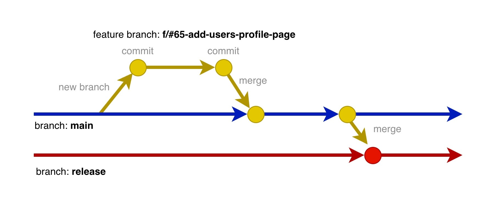

# OCPA Specifications

[](./VERSION)

A pragmatic repository specification for containerized apps. Feed it to your AI for bootstrapping or refactoring projects with standardized structure, POSIX scripts, and CI/CD integration.

## Using OCPA? Show it!

If your project follows the OCPA specifications, add this badge to your README to let others know:

```markdown
[](https://github.com/flavienbwk/ocpa-specs)
```

[](https://github.com/flavienbwk/ocpa-specs)

This helps spread the word and builds a community of standardized, well-structured containerized projects.

## Required

- Make ;
- Docker ;
- Docker Compose.

## Architecture overview

```txt
.
├── .github/workflows
│   ├── build-push.yml      // Checks dev/prod build and pushes images to desired registry with appropriate tags depending on branch
│   ├── deploy.yml          // Deploys the Helm chart (K8s) of your app
│   ├── linters.yml         // Include your project linters (envvars checks, secrets checks, markdownlint...)
│   └── test.yml            // Runs integration tests (make test)
├── service_1 (e.g, api)
│   ├── Dockerfile          // includes "dev" and "prod" targets
│   └── src
├── [...]                   // other services (e.g., app)
├── docs                    // For markdown resources
├── k8s                     // Helm chart with production-ready configuration tailored for envsubst variables substitution
│   ├── Chart.yaml
│   ├── templates
│   └── values.example.yaml
├── scripts
│   ├── auto-pull.sh        // Must be called by a CRON job to auto-pull and redeploy the project on release branch push
│   ├── deploy-helm.sh      // Script that handles all the additional logics for Helm deployment (used by deploy.yml and make commands)
│   └── validate-envs.sh    // Used in CI to check for missing, inconsistent or invalid env variables
├── .env.example            // Your single source of truth for host-side env variables
├── compose.base.yml        // Shared base services configuration (extended by dev/prod/test via `extends`)
├── compose.dev.yml         // Dev environment - extends base, set image name and build context, adds hot-reload volumes
├── compose.prod.yml        // Prod environment - extends base, set image name and build context, no volume mounts
├── compose.test.yml        // Test environment - extends base, set image name and build context, runs integration tests
├── Makefile                // Standardize commands to start dev or prod software, or deploy the project
├── README.md               // Documentation entrypoint
└── VERSION                 // Current software version, can be suffixed by -alpha or -beta
```

## Git workflow

OCPA v1 is well-suited to be used along with the [_Flexible Git Workflow_](https://book-devops.berwick.fr/eng/index.html#flexible-flow-a-balanced-git-workflow).

Workflow summarized: the main branch is `main`, each developer creates and merges 1 feature branch per issue and deployment gets triggered by a pull request to the `release` branch:



Each push to `main` will lead to the deployment of your staging environment (e.g, `demo.mywebsite.com`), and a merge to `release` will trigger production deployment (e.g., `mywebsite.com`)

If your git forge (e.g., GitHub, GitLab) allows it, configure your repo to respect OCPA-R7..R9 and create two organization teams:

- _Administrators_: have settings permissions privileges for all repos ;
- _Leaders_: can contribute to repos and validate PRs ;
- _Developers_: can contribute to repos (feature branches).

For deployment:

- For docker-compose-based deployment, setup [`scripts/auto-pull.sh`](./scripts/auto-pull.sh) on your machine (pull-based) ;
- For Kubernetes-based deployment, set GitHub secret `KUBE_CONFIG` and use the `deploy.yml` CI (push-based).

## Rules

- **OCPA-R1**: All versions must be fixed: mandatory lock files or hard-coded (whether for code packages or CI references). Also use specific versions instead of `latest` tags. ;
- **OCPA-R2**: A single markdown file must be at root of directory: `README.md`. Others must be placed in the `docs/` directory ;
- **OCPA-R3**: Makefile commands must at least include `dev`, `dev-[build,up,restart,down]` with aliases `[build,up,restart,down]`, `prod`, `prod-[build,up,restart,down]`, `helm-[deploy,uninstall]`, and `downa` to remove orphan containers (without removing volumes) ;
- **OCPA-R4**: Use [Flexible Flow](https://book-devops.berwick.fr/eng/index.html#flexible-flow-a-balanced-git-workflow) as git workflow ;
- **OCPA-R5**: All pull requests must be prefixed by the issue number (e.g., `#38: Solving SEO problem`): this helps keeping track of the context for the commit ;
- **OCPA-R6**: Every commit message should be prefixed by issue number (e.g., `#38: Added better meta description`): this helps keeping track of the context for the commit ;
- **OCPA-R7**: Repo must be configured to squash a pull request commits on a feature branch merge to `main` ;
- **OCPA-R8**: Repo must be configured to forbid force-push on `main` and `release` branches. Each PR must also be validate by 1 to ideally 2 _Leaders_ group members ;
- **OCPA-R9**: Repo must be configured to forbid force-merge on any branch, pipelines must succeed. If they are too slow, work on quickening them up! ;
- **OCPA-R10**: each service in compose file must declare logging limits, to avoid filling storage indefinitely with time ;

    ```bash
    myapp:
        logging:
            options:
                max-size: "1m"
    ```

- **OCPA-R11**: no trailing space nor inline comment in env variables, to avoid inconsistent processing of envs trailing spaces and comments among software ;

    Example of wrong declaration:

    ```env
    POSTGRES_PASSWORD=mysuperpassword  # Postgres password
    ```

    Example of good declaration:

    ```env
    # Postgres password
    POSTGRES_PASSWORD=mysuperpassword
    ```

- **OCPA-R12**: Don't define a compose network for your resources unless filling a specific purpose: it is often useless as compose already creates a network by default for your deployment ;

    Avoid this if not intentionally required:

    ```yml
    networks:
        myservicesnetwork:
            driver: bridge
    ```

- **OCPA-R13**: set healthchecks for each service: it lets orchestrators automatically detect and replace unhealthy containers, ensuring service availability ;
- **OCPA-R14**: set `restart: always|unless-stopped` property so your services restart after computer's reset. Prefer using `unless-stopped` by default or `always` if your service is critical (e.g., reverse proxy, monitoring agent) ;
- **OCPA-R15**: don't set `container_name`s until specifically required for your use case: docker already establishes a DNS record from service names inside the compose deployment ;
- **OCPA-R16**: set `platform` property for each service for project's cross-platform compatibility (e.g., `platform: linux/amd64` for Apple Silicon) ;
- **OCPA-R17**: any port open in each service must be listed in the `exposed` property but internal services that should not be exposed must not use the `ports` property (e.g, databases, redis...) ;
- **OCPA-R19**: services that must be exposed (using the `ports` property) must use an environment variable to flexibly adapt different environments (dev, staging, prod) ;
- **OCPA-R20**: any environment variable used inside a service must be listed in the `environments` property (respectively a configmap or similar for its Kubernetes configuration): this makes sure each environment variable is defined intentionally and introducing a new one is noticed ;
- **OCPA-R21**: any secret or global variable in each service must be using environment variables (e.g., Python's `os.getenv()`, PHP's `getenv()`...). They shall not have default values so software crashes if not intentionally set (cf. OPCA-R20, `./scripts/validate-envs.sh`) ;
- **OCPA-R22**: repository must include a LICENSE file or state the repo's license details in README.md (e.g, proprietary, MIT) ;
- **OCPA-R23**: there's no default `compose.yml` file and each compose file has a prefix to avoid deployment mistakes, making sure the user intentionally targets the right environment using `make` commands instead of compose commands directly ;
- **OCPA-R24**: each shell/bash script in `./scripts` or code in `Makefile` must be POSIX-compliant to allow maximum cross-compatibility and avoid CI pipelines errors ;
- **OCPA-R25**: use pre-commit script `./scripts/pre-commit` to help preserve maximum maintainability in your repo ;

### Auto-Pull (CRON)

For automated production deployments, set up a CRON job:

```bash
# Add to crontab
*/5 * * * * /path/to/project/scripts/auto-pull.sh >> /path/to/project/scripts/auto-pull.log 2>&1
```

### Pre-commit Hooks

Install the pre-commit hook to validate environment variables before each commit:

```bash
ln -sf ../../scripts/pre-commit .git/hooks/pre-commit
```

### Kubernetes Deployment

The `./k8s` directory contains a Helm chart. Variables in `values.example.yaml` use `${VAR}` syntax for `envsubst` substitution.

**GitHub Secrets required:**

- `KUBE_CONFIG`: Base64-encoded kubeconfig (`cat ~/.kube/config | base64 -w0`)

**GitHub Environment Variables (optional):**

- `INGRESS_ENABLED`, `INGRESS_CLASS`, `INGRESS_HOST`, `INGRESS_TLS_ENABLED`, `INGRESS_TLS_SECRET`
- `MARKSERV_PORT`, `REPLICAS`

**Local deployment:**

```bash
export IMAGE_REPOSITORY=ghcr.io/myorg/myrepo/markserv
export IMAGE_TAG=latest
make helm-deploy
```
